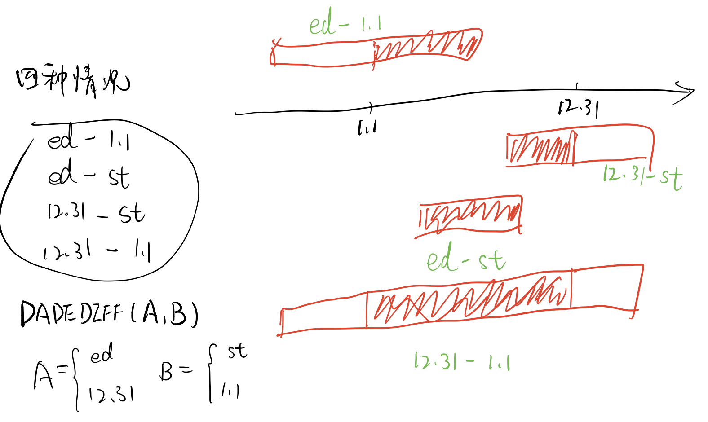

# 1384.(Hard) 按年度列出销售总额

Product 表：
```
+---------------+---------+
| Column Name   | Type    |
+---------------+---------+
| product_id    | int     |
| product_name  | varchar |
+---------------+---------+
product_id 是这张表的主键。
product_name 是产品的名称。
```

Sales 表：

```
+---------------------+---------+
| Column Name         | Type    |
+---------------------+---------+
| product_id          | int     |
| period_start        | date    |
| period_end          | date    |
| average_daily_sales | int     |
+---------------------+---------+
product_id 是这张表的主键。
period_start 和 period_end 是该产品销售期的起始日期和结束日期，且这两个日期包含在销售期内。
average_daily_sales 列存储销售期内该产品的日平均销售额。

```


编写一段 SQL 查询每个产品每年的总销售额，并包含 product_id, product_name 以及 report_year 等信息。

销售年份的日期介于 2018 年到 2020 年之间。你返回的结果需要按 product_id 和 report_year 排序。

查询结果格式如下例所示：

```
Product table:
+------------+--------------+
| product_id | product_name |
+------------+--------------+
| 1          | LC Phone     |
| 2          | LC T-Shirt   |
| 3          | LC Keychain  |
+------------+--------------+

Sales table:
+------------+--------------+-------------+---------------------+
| product_id | period_start | period_end  | average_daily_sales |
+------------+--------------+-------------+---------------------+
| 1          | 2019-01-25   | 2019-02-28  | 100                 |
| 2          | 2018-12-01   | 2020-01-01  | 10                  |
| 3          | 2019-12-01   | 2020-01-31  | 1                   |
+------------+--------------+-------------+---------------------+

Result table:
+------------+--------------+-------------+--------------+
| product_id | product_name | report_year | total_amount |
+------------+--------------+-------------+--------------+
| 1          | LC Phone     |    2019     | 3500         |
| 2          | LC T-Shirt   |    2018     | 310          |
| 2          | LC T-Shirt   |    2019     | 3650         |
| 2          | LC T-Shirt   |    2020     | 10           |
| 3          | LC Keychain  |    2019     | 31           |
| 3          | LC Keychain  |    2020     | 31           |
+------------+--------------+-------------+--------------+
LC Phone 在 2019-01-25 至 2019-02-28 期间销售，该产品销售时间总计35天。销售总额 35*100 = 3500。
LC T-shirt 在 2018-12-01 至 2020-01-01 期间销售，该产品在2018年、2019年、2020年的销售时间分别是31天、365天、1天，2018年、2019年、2020年的销售总额分别是31*10=310、365*10=3650、1*10=10。
LC Keychain 在 2019-12-01 至 2020-01-31 期间销售，该产品在2019年、2020年的销售时间分别是：31天、31天，2019年、2020年的销售总额分别是31*1=31、31*1=31。
```


来源：力扣（LeetCode）

链接：https://leetcode-cn.com/problems/total-sales-amount-by-year 

著作权归领扣网络所有。商业转载请联系官方授权，非商业转载请注明出处。


## Solution 

主要是列举DATEDIFF()的四种情况




```sql
(
SELECT s.product_id, product_name, '2018' as report_year,
	(DATEDIFF(IF(period_end<'2018-12-31',period_end,'2018-12-31'),
			  IF(period_start>'2018-01-01',period_start,'2018-01-01'))
				+1)*average_daily_sales total_amount
from Sales s, Product p WHERE p.product_id = s.product_id
HAVING total_amount>0
) union 
(
SELECT s.product_id, product_name, '2019' as report_year,
	(DATEDIFF(IF(period_end<'2019-12-31',period_end,'2019-12-31'),
			  IF(period_start>'2019-01-01',period_start,'2019-01-01'))
				+1)*average_daily_sales total_amount
from Sales s, Product p WHERE p.product_id = s.product_id
HAVING total_amount>0
) union
(
SELECT s.product_id, product_name, '2020' as report_year,
	(DATEDIFF(IF(period_end<'2020-12-31',period_end,'2020-12-31'),
			  IF(period_start>'2020-01-01',period_start,'2020-01-01'))
				+1)*average_daily_sales total_amount
from Sales s, Product p WHERE p.product_id = s.product_id
HAVING total_amount>0
) ORDER BY product_id, report_year
```
    
## Table Schema

```sql
Create table If Not Exists Product (product_id int, product_name varchar(30));
Create table If Not Exists Sales (product_id varchar(30), period_start date, period_end date, average_daily_sales int);
Truncate table Product;
insert into Product (product_id, product_name) values ('1', 'LC Phone ');
insert into Product (product_id, product_name) values ('2', 'LC T-Shirt');
insert into Product (product_id, product_name) values ('3', 'LC Keychain');
Truncate table Sales;
insert into Sales (product_id, period_start, period_end, average_daily_sales) values ('1', '2019-01-25', '2019-02-28', '100');
insert into Sales (product_id, period_start, period_end, average_daily_sales) values ('2', '2018-12-01', '2020-01-01', '10');
insert into Sales (product_id, period_start, period_end, average_daily_sales) values ('3', '2019-12-01', '2020-01-31', '1');
```